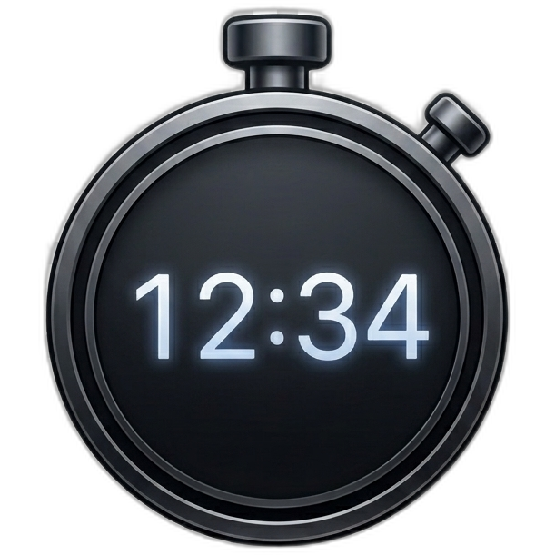

  

# JustAStopwatch

A perfectly lightweight, cross-platform, bloat-free stopwatch application for your macOS menu bar and Windows taskbar. Designed with performance and simplicity in mind, it provides the precise functionality you need without the unnecessary telemetry or tracking of other alternatives.

## Features

- **Cross-Platform Parity**: Available natively for both macOS (Menu Bar) and Windows (Taskbar overlay) with an identical feature set.
- **Click to Start/Pause**: A single left click on the timer instantly starts or pauses it.
- **Double-Click to Reset**: Rapidly double-click the timer to reset it back to zero.
- **Dynamic Formatting**: Keeps your taskbar and menu bar tidy. Displays as `MM:SS` (e.g. `00:00`), automatically expanding to `HH:MM:SS` when your timer reaches an hour.
- **Right-Click Menu**: Access application settings cleanly without interrupting your timer.
- **Launch on Startup**: Configure the app to automatically launch in the background when you log into your Mac or PC.
- **Over-The-Air Updates**: Built-in silent auto-updater securely checks GitHub Releases for new versions and smoothly applies them with a single click. (Protected by a safety guardrail that prevents updating while the timer is running!)

## Installation

### macOS
1. Navigate to the [Releases](https://github.com/Auxetics/JustAStopwatch/releases) tab.
2. Download the latest `JustAStopwatch.dmg` file.
3. Open the downloaded `.dmg` and drag the application directly into your `/Applications` folder.

### Windows
1. Navigate to the [Releases](https://github.com/Auxetics/JustAStopwatch/releases) tab.
2. Download the latest `JustAStopwatch.exe` file.
3. Simply run the file! The standalone executable will securely self-install into your `%AppData%` folder on first launch so you don't have to worry about accidentally deleting it.

## Troubleshooting

### macOS Security
Because this application is open-source and not distributed through the Mac App Store, modern macOS versions (like macOS Sequoia) may initially block the application with a popup offering to "Move to Trash" or "Done". To allow the app to run:
1. Click **Done** on the popup.
2. Open your Mac's **System Settings**.
3. Navigate to **Privacy & Security**.
4. Scroll down until you see a message stating that `JustAStopwatch` was blocked.
5. Click the **Open Anyway** button next to it.
6. The app will securely launch and appear in your menu bar!
